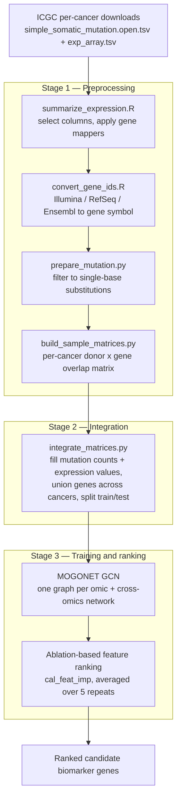

# Multi-Omics Biomarker Discovery in Cancer

**Identifying candidate cancer biomarkers by integrating somatic mutation and gene expression data with a graph convolutional network.**

This pipeline takes per-cancer somatic mutation and gene expression data from the ICGC Data Portal,
harmonises them onto a shared donor × gene feature space, trains
[MOGONET](https://github.com/txWang/MOGONET) — a graph convolutional network for multi-omics
classification — to predict tumour type, and then ranks individual genes by how much the model's
performance degrades when each one is ablated. Genes whose removal hurts prediction most are the
candidate biomarkers.

> **BSc thesis** · Sharif University of Technology · Sep 2022 – Jul 2023
>
> **Archived.** The ICGC DCC portal that supplied the source data has since retired, so the pipeline
> can no longer be run end to end from its original inputs. The code, method, and data contracts are
> preserved here as a record of the work.

---

## Pipeline



## Method notes

### Gene ID harmonisation

The most laborious part of the project, and the reason two of the four preprocessing scripts are in R.
ICGC projects did not publish expression data under a single identifier scheme — each submitting
consortium used whatever its assay platform emitted. The pipeline detects the scheme from the ID prefix
and normalises everything to HGNC gene symbols, which are the common key that mutation and expression
data are finally joined on:

| Identifier scheme | Example | Cancer type in this dataset | Mapped via |
| --- | --- | --- | --- |
| Illumina probe ID | `ILMN_1802380` | Pancreas | `illuminaHumanv4.db` |
| RefSeq | `NM_…` / `NR_…` | Nervous System | `bitr()`, `org.Hs.eg.db` |
| Versioned Ensembl | `ENSG00000141510.11` | Blood | version stripped, then `bitr()` |
| Bare gene symbol | `TP53` | all others | used directly |

### Feature space

Two omics views are built over one shared donor × gene index:

- **View 1 — mutation:** the number of simple somatic mutations in that gene for that donor,
  restricted to single-base substitutions.
- **View 2 — expression:** the normalized expression value for that gene in that donor.
- **View 3 — methylation:** the methylation value for that gene in that donor (dropped due to missing data).

A `(donor, gene)` cell is only retained where *both* modalities have data — stage 1 computes this
intersection per cancer type as a binary mask, and stage 2 fills the surviving cells with actual values.
The per-cancer matrices are then unioned into a single feature space across all cancer types, with genes
absent from a given cancer zero-filled.

### Classification task

Multi-class tumour-type prediction. Each donor is labelled with their cancer type, and any cancer type
with fewer than `--min-samples` donors (default 10) is dropped. The cancer types carried through
preprocessing are Brain, Breast, Colorectal, Lung, Nervous System, Pancreas, Uterus, and Blood.

### Biomarker ranking

Biomarkers come from MOGONET's ablation procedure (`cal_feat_imp`) rather than from network weights:
each feature is ablated in turn and the resulting drop in classification performance is recorded, so a
larger drop means the model relied on that gene more heavily. The ranking is repeated across 5 trained
models and averaged by `summarize_imp_feat` to reduce the variance of any single run.

### lncRNA scope

The thesis framing was to look for biomarkers among long non-coding RNAs. The mechanism for this is in
`get_genes()`: the gene list (`genes_list.tsv`) carries a `gene_class` column, and passing `gene_class`
restricts the feature space to a single class of gene. Note that the committed pipeline calls
`get_genes()` without that argument, so the runs it reproduces as-is are over the full gene list —
the lncRNA restriction is a one-argument change, not a separate code path.

## Repository layout

```
.
├── 01_preprocessing/           Stage 1 — clean, harmonise, and intersect the two omics
│   ├── summarize_expression.R      expression columns + per-cancer gene mappers
│   ├── convert_gene_ids.R          probe/RefSeq/Ensembl → gene symbol
│   ├── prepare_mutation.py         mutation filtering and gene symbol join
│   └── build_sample_matrices.py    per-cancer donor × gene overlap matrix
├── 02_integration/             Stage 2 — build the MOGONET input matrices
│   └── integrate_matrices.py
├── 03_training/                Stage 3 — train the GCN and rank features
│   └── runner.py
└── requirements.txt
```

Each stage directory has its own README with inputs, commands, and outputs.

## Data

Source data came from the ICGC Data Portal, downloaded per cancer type into one directory each:

```
data/
├── genes_list.tsv                          gene universe (gene_name, gene_symbol, gene_class)
├── Brain/
│   ├── simple_somatic_mutation.open.tsv
│   └── exp_array.tsv
├── Breast/
│   └── …
└── …
```

The ICGC DCC portal has since retired and these files are no longer available from their original
location, so the repository documents the expected schema rather than shipping data. No patient data is
included here, and `data/` and `output/` are gitignored.

## Requirements

**Python** (stages 1–2):

```bash
pip install -r requirements.txt
```

Note that `pandas` is pinned below 2.0 — the code uses `DataFrame.iteritems()`, which 2.0 removed.

**R / Bioconductor** (stage 1):

```r
install.packages("BiocManager")
BiocManager::install(c("illuminaHumanv4.db", "clusterProfiler", "org.Hs.eg.db"))
```

**Stage 3** runs inside a clone of [MOGONET](https://github.com/txWang/MOGONET) and uses that project's
dependencies (PyTorch, scikit-learn). A GPU is strongly recommended: training is 500 pretraining epochs
followed by 2500 full epochs, repeated 5 times for the feature ranking.

## Running the pipeline

**Stage 1 — preprocessing.** Order matters here: the R scripts must run *before* the Python scripts,
because `build_sample_matrices.py` reads the `converted_genes.csv` they emit for the cancer types that
need ID conversion.

```bash
Rscript 01_preprocessing/summarize_expression.R
Rscript 01_preprocessing/convert_gene_ids.R      # per cancer type needing conversion
python 01_preprocessing/prepare_mutation.py      --cancer-type Brain
python 01_preprocessing/build_sample_matrices.py --cancer-type Brain
```

**Stage 2 — integration.** Produces the eight files MOGONET expects:

```bash
python 02_integration/integrate_matrices.py \
    --data-dir      ./data \
    --matrices-path ./output \
    --out-dir       ICGC \
    --min-samples   10 \
    --train-split   0.70
```

**Stage 3 — training and ranking.** Clone MOGONET, copy the stage-2 output directory into it, then
train and rank. See [03_training/README.md](03_training/README.md) for the details.

```bash
git clone https://github.com/txWang/MOGONET.git
cp -r ICGC MOGONET/
```

Every Python script takes `--help`.

## Results

A completed run produces three things: trained MOGONET models under `<out-dir>/models/`, per-class
classification metrics on the held-out test split, and a ranked feature list per omics view — the
ablation importance of every gene, which is the actual output of interest.

Written with hindsight — the original thesis report (in Persian) concluded by reporting the top-ranked genes and left further validation to future work. 

## Acknowledgements

- [MOGONET](https://github.com/txWang/MOGONET) — Wang et al., *Nature Communications* 12, 3445 (2021),
  "MOGONET integrates multi-omics data using graph convolutional networks allowing patient
  classification and biomarker identification." This project uses MOGONET as its classification backbone;
  it is cloned separately rather than vendored here.
- International Cancer Genome Consortium (ICGC) for the source mutation and expression data.

## License

[MIT](LICENSE)
